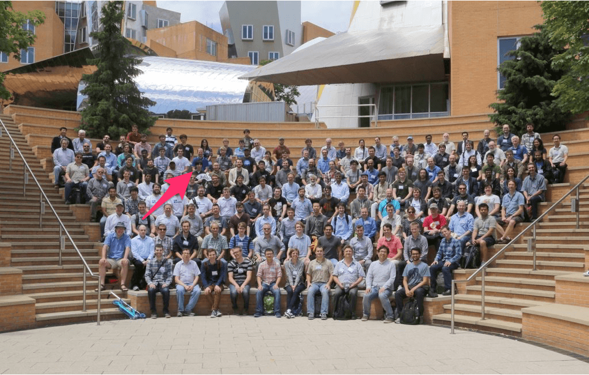
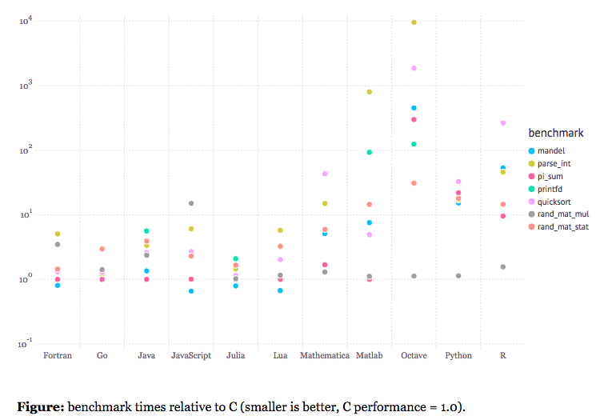
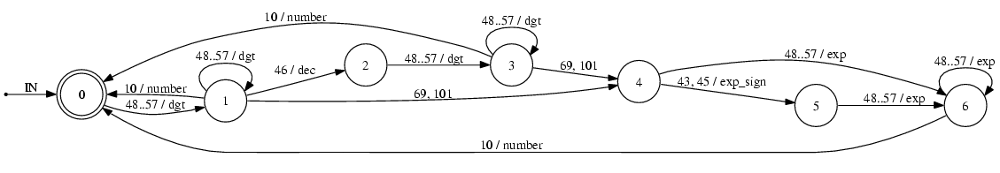

class: center, middle

# Introduction to Julia <br> for Bioinformatics

Kenta Sato (佐藤建太)

@ Bioinformatics Research Unit, RIKEN ACCC

November 19, 2015

---

## Topics

* About Me
* Julia
* BioJulia
* Julia Updates '15

---

### About Me

* Graduate school student at the University of Tokyo.
* About 2-year experience of Julia programming.
* Contributing to Julia and its ecosystem:
    * https://github.com/docopt/DocOpt.jl
    * https://github.com/bicycle1885/IntArrays.jl
    * https://github.com/BioJulia/IndexableBitVectors.jl
    * https://github.com/BioJulia/WaveletMatrices.jl
    * https://github.com/BioJulia/FMIndexes.jl
    * https://github.com/isagalaev/highlight.js (Julia support)
    * etc.
* Core developer of BioJulia - https://github.com/BioJulia/Bio.jl
* Julia Summer of Code 2015 Student - http://julialang.org/blog/2015/10/biojulia-sequence-analysis/

---

### JuliaCon 2015 at MIT, Boston



https://twitter.com/acidflask/status/633349038226690048

---
layout: false

### Julia is ...

> Julia is a **high-level, high-performance dynamic programming language** for technical computing, with syntax that is familiar to users of other technical computing environments. It provides a sophisticated compiler, distributed parallel execution, numerical accuracy, and an extensive mathematical function library. Julia’s Base library, largely written in Julia itself, also integrates mature, best-of-breed open source C and Fortran libraries for linear algebra, random number generation, signal processing, and string processing. .cite[http://julialang.org/]

---
layout: true

### Two-Language Problem

---

In technical computing, users use easier and slower script languages, while developers use harder and faster compiled languages.


---

Both users and developers can use a handy language without sacrificing performance.


---
layout: false

### Three Virtues of the Julia Language

* Simple
* Fast
* Dynamic

---
layout: true

#### Simple

---

.column-left[
* Syntax with least astonishment
    * no semicolons
    * no variable declarations
    * no argument types
    * Unicode support
    * 1-based index
    * blocks end with **`end`**
* No implicit type conversion
* Quick sort with 24 lines
]
.column-right[
.font70[

```julia
quicksort(xs) = quicksort!(copy(xs))
quicksort!(xs) = quicksort!(xs, 1, endof(xs))

function quicksort!(xs, lo, hi)
    if lo < hi
        p = partition(xs, lo, hi)
        quicksort!(xs, lo, p - 1)
        quicksort!(xs, p + 1, hi)
    end
    return xs
end

function partition(xs, lo, hi)
    pivot = div(lo + hi, 2)
    pvalue = xs[pivot]
    xs[pivot], xs[hi] = xs[hi], xs[pivot]
    j = lo
    @inbounds for i in lo:hi-1
        if xs[i] ≤ pvalue
            xs[i], xs[j] = xs[j], xs[i]
            j += 1
        end
    end
    xs[j], xs[hi] = xs[hi], xs[j]
    return j
end
```

]
]

---
layout: true

#### Fast

---

Comparable performance to compiled languages.

<figure>
    
</figure>

.cite[http://julialang.org/]

---

The LLVM-backed JIT compiler emits machine code at runtime.

```julia
julia> 4 >> 1  # bitwise right-shift function
2

julia> @code_native 4 >> 1
        .section        __TEXT,__text,regular,pure_instructions
Filename: int.jl
Source line: 115
        pushq   %rbp
        movq    %rsp, %rbp
        movl    $63, %ecx
        cmpq    $63, %rsi
Source line: 115
        cmovbeq %rsi, %rcx
        sarq    %cl, %rdi
        movq    %rdi, %rax
        popq    %rbp
        ret

```

---
layout: true

#### Dynamic

---

No need to precompile your program.

hello.jl:
```julia
println("hello, world")
```

Output:
```bash
$ julia hello.jl
hello, world
```

In REPL:
```julia
julia> include("hello.jl")
hello, world
```


---

High-level code generation at runtime (macros).

```julia
julia> x = 5
5

julia> @assert x > 0 "x should be positive"

julia> x = -2
-2

julia> @assert x > 0 "x should be positive"
ERROR: AssertionError: x should be positive

julia> macroexpand(:(@assert x > 0 "x should be positive"))
:(if x > 0
        nothing
    else
        Base.throw(Base.Main.Base.AssertionError("x should be positive"))
    end)
```

---
layout: false

### Who Created?

Jeff Bezanson, Stefan Karpinski, Viral B. Shah, and Alan Edelman

> Soon the team was building their dream language. MIT, where Bezanson is a graduate student, became an anchor for the project, with much of the work being done within computer scientist and mathematician Alan Edelman’s research group. But development of the language remained completely distributed. “Jeff and I didn’t actually meet until we’d been working on it for over a year, and Viral was in India the entire time,” Karpinski says. “So the whole language was designed over email.”
.cite["Out in the Open: Man Creates One Programming Language to Rule Them All" - http://www.wired.com/2014/02/julia/]


---
layout: true

### Why Created?

---

<div style="height: 80%; display:flex;justify-content:center;align-items:center;">
<blockquote style="font-size: 1.5em;">
        In short, because we are greedy.
        <span class="cite">"Why We Created Julia" - <a href="http://julialang.org/blog/2012/02/why-we-created-julia/">http://julialang.org/blog/2012/02/why-we-created-julia/</a> </span>
    </blockquote>
</div>

---

The creators wanted a language that satisfies:

* the speed of *C*
* with the dynamism of *Ruby*
* macros like *Lisp*
* mathematical notations like *Matlab*
* as usable for general programming as *Python*
* as easy for statistics as *R*
* as natural for string processing as *Perl*
* as powerful for linear algebra as *Matlab*
* as good at gluing programs together as the *shell*

---
layout: true

### Batteries Included

You can start technical computing without installing lots of libraries.

---

* Numeric types
    * {8, 16, 32, 64, 128}-bit {signed, unsigned} integers,
    * 16, 32, 64-bit floating point numbers,
    * and arbitrary-precision numbers.
* Numerical linear algebra
    * matrix multiplication, matrix decomposition/factorization, solver for system of linear equations, and more!
    * sparse matrices
* Random number generator
    * Mersenne-Twister method accelerated by SIMD

---

* Unicode support
* Perl-compatible regular expressions (PCRE)
* Parallel computing
* Dates and times
* Unit tests
* Profiler
* Package manager

---
layout: false
class: center, middle

## Language Design

---

### Literals

.column-left[
```julia
# Int64
42
10_000_000

# UInt8
0x1f

# Float64
3.14
6.022e23

# Bool
true
false

# UnitRange{Int64}
1:100

# ASCIIString
"ascii string"
```
]
.column-right[
```julia
# UTF8String
"UTF8文字列"

# Regex
r"^>[^\n]+\n[ACGTN]+"

# Array{Float64,1}
# (Vector{Float64})
[1.0, 1.1, 1.2]

# Array{Float64,2}
# (Matrix{Float64})
[1.0  1.1;
 2.0  2.2]

# Tuple{Int,Float64,ASCIIString}
(42, 3.14, "ascii string")

# Dict{ASCIIString,Int64}
Dict("one" => 1, "two", => 2)
```
]

---

### Functions

All function definitions below are equivalent:

```julia
function func(x, y)
    return x + y
end

function func(x, y)
    x + y
end

func(x, y) = return x + y

func(x, y) = x + y
```

Force inlining:
```julia
@inline func(x, y) = x + y
```

.note[This simple function will be automatically inlined by the compiler.]

---

#### Functions - Arguments

.font80[

.column-left[

Optional arguments:
```julia
function increment(x, by=1)
    return x + by
end

increment(3)     # 4
increment(3, 2)  # 5
```

Keyword arguments:
```julia
function increment(x; by=1)
    return x + by
end

increment(3)       # 4
increment(3, by=2) # 5
```

.note[Notice semicolon (`;`) in the argument list above.]

]
.column-right[

Variable number of arguments:
```julia
function pushback!(list, vals...)
    for val in vals
        push!(list, val)
    end
    return list
end

pushback!([])        # []
pushback!([], 1)     # [1]
pushback!([], 1, 2)  # [1, 2]
```
]
]

---

#### Functions - Return Values

You can return multiple values from a function as a tuple:

```julia
function divrem64(n)
    return n >> 6, n & 0b111111
end
```

And you can receive returned values with multiple assignments:

```julia
julia> divrem64(1025)
(16,1)

julia> d, r = divrem64(1025)
(16,1)

julia> d
16

julia> r
1

```

---

#### Functions - Document

A document string can be attached to a function definition:

```julia
"""
This function computes quotient and remainder
divided by 64 for a non-negative integer.
"""
function divrem64(n)
    return n >> 6, n & 0b111111
end
```

In REPL, you can read the attached document with the `?` command:

```julia
help?> divrem64
search: divrem64 divrem

  This function computes quotient and remainder
  divided by 64 for a non-negative integer.
```

---

### Types

* Two kinds of types:
    * concrete types: instantiatable
    * abstract types: not instantiatable

<figure>
    
</figure>

---

#### Defining Types

.column-left[
Abstract type:
```julia
abstract AbstractFloat <: Real
```

Composite type:
```julia
# mutable
type Point
    x::Float64
    y::Float64
end

# immutable
immutable Point
    x::Float64
    y::Float64
end
```
]

.column-right[
Bits type:
```julia
bitstype 64 Int64 <: Signed
```

Type alias:
```julia
typealias UInt UInt64
```

Enum:
```julia
@enum Vote positive negative
```
]

---

#### Parametric Types

* Types can take *type parameters*:

```julia
type Point{T}
    x::T
    y::T
end
```

* `Point`: abstract type
* `Point{Int64}`: concrete type
    * subtype of `Point` (`Point{Int64} <: Point`)
    * all of the members (i.e. `x` and `y`) are `Int64`s

```julia
type NucleotideSequence{T<:Nucleotide} <: Sequence
    data::Vector{UInt64}
    ...
end
```

---

#### Constructors

* Julia automatically generates default constructors.
    * `Point(1, 2)` creates an object of `Point{Int}` type.
    * `Point(1.0, 2.0)` creates an object of `Point{Float64}` type.
    * `Point{Float64}(1, 2)` creates an object of `Point{Float64}` type.
* Users can create custom constructors.

```julia
type Point{T}
    x::T
    y::T
end

# outer constructor
function Point(x)
    return Point(x, x)
end

p = Point(1)  #> Point{Int64}(1, 1)
```

---

#### Memory Layout

* Compact memory layout like C's `struct`s
    * C compatible memory layout
    * You can pass Julia objects to C functions without copy.
* This is especially important in bioinformatics
    * when defining data structures for efficient algorithms
    * when handling lots of small objects

.font80[
```julia
julia> @enum Strand forward reverse both unknown

julia> immutable Exon
           chrom::Int
           start::Int
           stop::Int
           strand::Strand
       end

julia> sizeof(Exon(1, 12345, 12446, forward))
32

```
]

---

### Multiple Dispatch

Combination of all argument types determines a called method.

.font80[
.column-left[
Single dispatch (e.g. Python)

* The first argument is special and determines a method.
]
.column-right[
Multiple dispatch (e.g. Julia)

* All arguments are equally responsible to determine a method.
]
]

.font75[
.column-left[
```python
class Serializer:
    def write(self, val):
        if isinstance(val, int)
            # ...
        elif isinstance(val, float)
            # ...
        #...
```

]
.column-right[

```julia
function write(dst::Serializer,
               val::Int64)
    # ...
end

function write(dst::Serializer,
               val::Float64)
    # ...
end

# ...
```
]

]

---

#### Multiple Dispatch - Example (1)

base/char.jl:

```julia
-(x::Char, y::Char)    = Int(x) - Int(y)
-(x::Char, y::Integer) = Char(Int32(x) - Int32(y))
+(x::Char, y::Integer) = Char(Int32(x) + Int32(y))
+(x::Integer, y::Char) = y + x
```

```julia
julia> 'c' - 'a'
2

julia> 'c' - 1
'b'

julia> 'a' + 0x01
'b'

julia> 0x01 + 'a'
'b'
```

---

#### Multiple Dispatch - Example (2)

.font85[
```julia
function has{T<:Integer}(range::UnitRange{Int}, target::T)
    return first(range) ≤ target ≤ last(range)
end

function has(iter, target)  # same as has(iter::Any, target::Any)
    for elm in iter
        if elm == target
            return true
        end
    end
    return false
end
```

```julia
julia> has(1:10, 4)
true

julia> has(1:10, -2)
false

julia> has([1,2,3], 2)
true
```
]

---

### Metaprogramming

* Julia can represent its own program code as a data structure (`Expr`).
* Three metaprogramming components in Julia:
    * Macros
        * generate an expression from expressions.
        * `Expr ↦ Expr`
    * Generated functions
        * generate an expression from types.
        * `Types ↦ Expr`
    * Non-standard string literals
        * generate an expression from a string.
        * `String ↦ Expr`

---

#### Metaprogramming - Macros

* Generate an expression from expressions.
    * `Expr ↦ Expr`
* Denoted as `@<macro name>`.
    * Distinguishable from function calls
    * We've already seen some macros.

```julia
macro assert(ex)
    msg = string(ex)
    :($ex ? nothing : throw(AssertionError($msg)))
end
```

```julia
julia> x = -1
-1

julia> @assert x > 1
ERROR: AssertionError: x > 1

```

---

#### Metaprogramming - Useful Macros (1)

`@show`: print variables, useful for debug:
```julia
julia> x = -1
-1

julia> @show x
x = -1
```

`@inbounds`: omit to check bounds:
```julia
@inbounds h[i,j] = h[i-1,j-1] + submat[a[i],b[j]]
```

`@which`: return which function will be called:
```julia
julia> @which max(1, 2)
max{T<:Real}(x::T<:Real, y::T<:Real) at promotion.jl:239
```

---

#### Metaprogramming - Useful Macros (2)

`@time`: measure elapsed time to evaluate the expression:
```julia
julia> xs = rand(1_000_000);

julia> @time sum(xs)
  0.022633 seconds (27.24 k allocations: 1.155 MB)
499795.2805424741

julia> @time sum(xs)
  0.000574 seconds (5 allocations: 176 bytes)
499795.2805424741

```

`@profile`: profile the expression:
```julia
julia> sort(xs); @profile sort(xs);

julia> Profile.print()
69 REPL.jl; anonymous; line: 92
 68 REPL.jl; eval_user_input; line: 62
...
```

---

#### Generated Functions

* Generate a specialized program code for argument types.
    * `Type(s) ↦ Expr`
* Same as function call.
    * indistinguishable syntax from a calling site

```julia
@generated function _sub2ind{N,M}(dims::NTuple{N,Integer},
                                  subs::NTuple{M,Integer})
    meta = Expr(:meta, :inline)
    ex = :(subs[$M] - 1)
    for i = M-1:-1:1
        if i > N
            ex = :(subs[$i] - 1 + $ex)
        else
            ex = :(subs[$i] - 1 + dims[$i]*$ex)
        end
    end
    Expr(:block, meta, :($ex + 1))
end
```

---

#### Non-standard String Literals

* Generate an expression from a string.
    * `String ↦ Expr`
* Denoted as `<literal name>"..."`
* Regular expression literal (e.g. `r"^>[^\n]+\n[ACGTN]+"`) is an example.
* In Bio.jl, `dna"ACGT"` is converted to a `DNASequence` object.

```julia
macro r_str(s)
    Regex(s)
end

# Regex object
r"^>[^\n]+\n[ACGTN]+"

# DNASequence object
dna"ACGT"
```

---

### Modules

* Modules are namespace.
    * Names right under a module are considered as global names.
    * Import/export system enables to exchange names between modules.

.column-left[
```julia
module Foo

export foo, gvar

# function
foo() = println("hello, foo")
bar() = println("hello, bar")

# global variable
const gvar = 42

end
```
]

.column-right[
```julia
Foo.foo()
Foo.bar()
Foo.gvar

import Foo: foo
foo()

import Foo: bar
bar()

using Foo
foo()
gvar
```
]

---

### Packages

* A package manager is bundled with Julia.
    * No other package manager; this is the standard.
    * The package manager can build, install, and create packages.
    * Almost all packages are hosted on GitHub.
* Registered packages
    * Registered packages are public packages that can be installed by name.
    * List: http://pkg.julialang.org/
    * Repository: https://github.com/JuliaLang/METADATA.jl

---

#### Packages - Management

* The package manager is accessible from REPL.
    * `Pkg.update()`: update registered package data and upgrade packages
* The way to install a package depends on whether the package is registered or not.
    * `Pkg.add(<package>)`: install a registered package
    * `Pkg.clone(<url>)`: install a package from the git URL

```julia
julia> Pkg.update()

julia> Pkg.add("DocOpt")

julia> Pkg.clone("git@github.com:docopt/DocOpt.jl.git")
```

---

#### Packages - Create a Package

* Package template can be generated with `Pkg.generate(<package>)`.
    * This generates a disciplined scaffold to develop a new package.
    * Generated packages will be located in `~/.julia/v0.4/`.
* `Pkg.tag(<package>, <version>)` tags the version to the current commit of the package.
    * This tag is considered as a release of the package.
    * Developers should follow [Semantic Versioning](http://semver.org/).
        * major: incompatible API changes
        * minor: backwards-compatible functionality addition
        * patch: backwards-compatible bug fixes

```julia
julia> Pkg.generate("DocOpt")

julia> Pkg.tag("DocOpt", :patch)  # patch update
```

---
class: center, middle

## BioJulia

---

### BioJulia

* Collaborative project to build bioinformatics infrastructure for Julia.
* Packages:
    * Bio.jl - https://github.com/BioJulia/Bio.jl
    * Other packages - https://github.com/BioJulia

<figure>
    
</figure>

---

#### BioJulia - Basic Principles

* BioJulia will be fast.
* All contributions undergo code review.
* We'll design it to suit modern bioinformatics and Julia, not just copy other Bio-projects.

https://github.com/BioJulia/Bio.jl/wiki/roadmap


---

### Bio.jl

* Major modules:
    * `Bio.Seq`: biological sequences
    * `Bio.Intervals`: genomic intervals
    * `Bio.Align`: sequence alignments (coming soon!)
    * `Bio.Phylo`: phylogenetics (common soon!)
* Under (active!) development.

--


---

### Sequences

* Sequence types are defined in `Bio.Seq` module:
    * `DNASequence`, `RNASequence`, `AminoAcidSequence`, `Kmer`

```julia
julia> using Bio.Seq

julia> dna"ACGTN"  # non-standard string literal
5nt DNA Sequence
 ACGTN

julia> rna"ACGUN"
5nt RNA Sequence
 ACGUN

julia> aa"ARNDCWYV"
8aa Sequence:
 ARNDCWYV

julia> kmer(dna"ACGT")
DNA 4-mer:
 ACGT
```

---

#### Sequences - Packed Nucleotides

* `A/C/G/T` are packed into an array with 2-bit encoding (+1 bit for `N`).

```julia
type NucleotideSequence{T<:Nucleotide} <: Sequence
    data::Vector{UInt64} # 2-bit encoded sequence
    ns::BitVector        # 'N' mask
    ...
end
```

* In `Kmer`, nucleotides are packed into a 64-bit type.

```julia
bitstype 64 Kmer{T<:Nucleotide, K}
typealias DNAKmer{K} Kmer{DNANucleotide, K}
typealias RNAKmer{K} Kmer{RNANucleotide, K}
```

---

#### Sequences - Immutable by Convention

* Sequences are immutable by convention.
* No copy when creating a subsequence from an existing sequence.

```julia
julia> seq = dna"ACGTATG"
7nt DNA Sequence
 ACGTATG

julia> seq[2:4]
3nt DNA Sequence
 CGT

# internal data is shared between
# the original and its subsequences
julia> seq.data === seq[2:4].data
true
```

---

### Intervals

* Genomic interval types are defined in `Bio.Intervals` module:
    * `Interval{T}`: `T` is the type of metadata attached to the interval.

```julia
type Interval{T} <: AbstractInterval{Int64}
    seqname::StringField
    first::Int64
    last::Int64
    strand::Strand
    metadata::T
end
```

This is useful when annotating a genomic range:

```julia
julia> using Bio.Intervals

julia> Interval("chr2", 5692667, 5701385, '+', "SOX11")
chr2:5692667-5701385    +    SOX11
```

---

#### Intervals - Indexed Collections

Set of intervals can be indexed by `IntervalCollection`:

```julia
immutable CDS; gene::ASCIIString; index::Int; end

ivals = IntervalCollection{CDS}()
push!(ivals, Interval("chr6", 156777930, 156779471, '+',
                      CDS("ARID1B", 1)))
push!(ivals, Interval("chr6", 156829227, 156829421, '+',
                      CDS("ARID1B", 2)))
push!(ivals, Interval("chr6", 156901376, 156901525, '+',
                      CDS("ARID1B", 3)))
```

`intersect` iterates over intersecting intervals:

```julia
julia> query = Interval("chr6", 156829200, 156829300);
julia> for i in intersect(ivals, query)
           println(i)
       end
chr6:156829227-156829421    +    CDS("ARID1B",2)
```

---

### Parsers

* Parsers are generated from the Ragel state machine compiler.
    * Finite state machines are described in regular language.
    * The Ragel compiler generates pure Julia programs.
    * Actions can be injected into the state transition.
* The next Ragel release (v7) will be shipped with the Julia generator.
    * http://www.colm.net/open-source/ragel/



---

#### Parsers - FASTA

`<name> = <expression> > <entering action> %<leaving action>;`

FASTA parser:
```ragel
newline     = '\r'? '\n'     >count_line;
hspace      = [ \t\v];
whitespace  = space | newline;

identifier  = (any - space)+            >mark  %identifier;
description = ((any - hspace) [^\r\n]*) >mark  %description;
letters     = (any - space - '>')+      >mark  %letters;
sequence    = whitespace* letters? (whitespace+ letters)*;
fasta_entry = '>' identifier (hspace+ description)? newline
                  sequence whitespace*;

main := whitespace* (fasta_entry %finish_match)**;
```

* https://github.com/BioJulia/Bio.jl/blob/master/src/seq/fasta.rl
* https://github.com/BioJulia/Bio.jl/blob/master/src/seq/fasta.jl

---

#### Parsers - Fast

* Ragel can generate fast parsers.

```julia
julia> @time for rec in open("hg38.fa", FASTA)
           println(rec)
       end
>chr1
248956422nt Mutable DNA Sequence
 NNNNNNNNNNNNNNNNNNNNNNN…NNNNNNNNNNNNNNNNNNNNNNNN
>chr10
133797422nt Mutable DNA Sequence
 NNNNNNNNNNNNNNNNNNNNNNN…NNNNNNNNNNNNNNNNNNNNNNNN

# ...

>chrY_KI270740v1_random
37240nt Mutable DNA Sequence
 TAATAAATTTTGAAGAAAATGAA…GAATGAAGCTGCAGACATTTACGG
 32.198314 seconds (174.92 k allocations: 1.464 GB, 1.14% gc time)
```

---

### Alignments

The `Bio.Align` module supports various pairwise alignment types.

* Score maximization:
    * `GlobalAlignment`
    * `SemiGlobalAlignment`
    * `OverlapAlignment`
    * `LocalAlignment`
* Cost minimization:
    * `EditDistance`
    * `LevenshteinDistance`
    * `HammingDistance`

---

#### Alignments - Simple Interfaces (1)

```julia
julia> affinegap = AffineGapScoreModel(match=5,
                                       mismatch=-4,
                                       gap_open=-3,
                                       gap_extend=-2);

julia> pairalign(GlobalAlignment(),
                 dna"ATGGTGACT",
                 dna"ACGTGCCCT",
                 affinegap)
PairwiseAlignment{Int64,Bio.Seq.NucleotideSequence{Bio.Seq.DNANucleotide},Bio.Seq.NucleotideSequence{Bio.Seq.DNANucleotide}}:
  score: 12
  seq: ATGGTGAC-T
       | | || | |
  ref: ACG-TGCCCT

```

---

#### Alignments - Simple Interfaces (2)

`pairalign(<type>, <seq1>, <seq2>, <score/cost model>)`

```julia
pairalign(GlobalAlignment(), a, b, model)
pairalign(SemiGlobalAlignment(), a, b, model)
pairalign(OverlapAlignment(), a, b, model)
pairalign(LocalAlignment(), a, b, model)
pairalign(EditDistance(), a, b, model)
pairalign(LevenshteinDistance(), a, b)
pairalign(HammingDistance(), a, b)
```

Alignment options:

```julia
pairalign(GlobalAlignment(), a, b, model, banded=true)
pairalign(GlobalAlignment(), a, b, model, score_only=true)
```

---

#### Alignments - Speed (1)

Global alignment of titin sequences (human and mouse):

```julia
affinegap = AffineGapScoreModel(BLOSUM62, -10, -1)
a = first(open("Q8WZ42.fasta", FASTA)).seq
b = first(open("A2ASS6.fasta", FASTA)).seq
@time aln = pairalign(
    GlobalAlignment(),
    Vector{AminoAcid}(a),
    Vector{AminoAcid}(b),
    affinegap,
)
println(score(aln))
```

```text
  8.012499 seconds (601.99 k allocations: 1.155 GB, 0.09% gc time)
165611
```

vs. R (Biostrings):

```text
   user  system elapsed
 14.042   1.233  15.475
```

---

#### Alignments - Speed (2)

vs. R (Biostrings):

```text
   user  system elapsed
 14.042   1.233  15.475
```

```r
library(Biostrings, quietly=T)
a = readAAStringSet("Q8WZ42.fasta")[[1]]
b = readAAStringSet("A2ASS6.fasta")[[1]]
t0 = proc.time()
aln = pairwiseAlignment(a, b, type="global",
                        substitutionMatrix="BLOSUM62",
                        gapOpening=10, gapExtension=1)
t1 = proc.time()
print(t1 - t0)
print(score(aln))
```

---

### Indexable Bit Vectors

* Bit vectors that supports bit counting in constant time.
    * `rank1(bv, i)`: Count the number of 1 bits within `bv[1:i]`.
    * `rank0(bv, i)`: Count the number of 0 bits within `bv[1:i]`.
* A fundamental data structure when defining other data structures.
    * `WaveletMatrix`, a generalization of the indexable bit vector, depends on this data structure.
    * `'N'` nucleotides in a reference sequence can be compressed using this data structure.

```julia
julia> bv = SucVector(bitrand(10_000_000));

julia> rank1(bv, 9_000_000);  # precompile

julia> @time rank1(bv, 9_000_000)
  0.000006 seconds (149 allocations: 10.167 KB)
4502258
```

---

#### Indexable Bit Vectors - Internals

A bit vector is divided into 256-bit large blocks and each large block is divided into 64-bit small blocks:

.font70[
```julia
immutable Block
    # large block
    large::UInt32
    # small blocks
    smalls::NTuple{4,UInt8}
    # bit chunks (64bits × 4 = 256bits)
    chunks::NTuple{4,UInt64}
end
```
]

Each block has a cache that counts the number of `1`s.

<figure>
    
</figure>

---

### FM-Indexes

* Index for full-text search.
    * Fast, compact, and often used in short-read sequence mappers (Bowtie2, BWA, etc.).
    * Product of Julia Summer of Code 2015 https://github.com/BioJulia/FMIndexes.jl
* This package is **not** specialized for biological sequences.
    * FMIndexes.jl does not depend on Bio.jl.
    * JIT compiler can optimize code for a specific type at runtime.

```julia
julia> fmindex = FMIndex(dna"ACGTATTGACTGTA");

julia> count(dna"TA", fmindex)
2

julia> count(dna"TATT", fmindex)
1
```

---
layout: true

#### FM-Indexed - Queries

Create an FM-Index for chromosome 22:
```julia
julia> fmindex = FMIndex(first(open("chr22.fa", FASTA)).seq);
```

---

`count(pattern, index)`: count the number of occurrences of `pattern`:

```julia
julia> count(dna"ACGT", fmindex)
37672

julia> count(dna"ACGTACGT", fmindex)
42

```

---

`locate(pattern, index)`: locate positions of `pattern`:

```julia
# locate returns an iterator
julia> locate(dna"ACGTACGT", fmindex) |> collect
42-element Array{Any,1}:
 20774876
        ⋮
 22729149

# locateall returns an array
julia> locateall(dna"ACGTACGT", fmindex)
42-element Array{Int64,1}:
 20774876
        ⋮
 22729149

```

---
layout: true

### Other Julia Orgs You Should Know

---

Statistics - JuliaStats https://github.com/JuliaStats

* https://github.com/JuliaStats/StatsBase.jl
* https://github.com/JuliaStats/DataFrames.jl
* https://github.com/JuliaStats/Clustering.jl
* https://github.com/JuliaStats/Distributions.jl
* https://github.com/JuliaStats/MultivariateStats.jl
* https://github.com/JuliaStats/NullableArrays.jl
* https://github.com/JuliaStats/GLM.jl

---

Optimization - JuliaOpt https://github.com/JuliaOpt

* https://github.com/JuliaOpt/JuMP.jl
* https://github.com/JuliaOpt/Optim.jl
* https://github.com/JuliaOpt/Convex.jl

Graphs - JuliaGraphs https://github.com/JuliaGraphs

* https://github.com/JuliaGraphs/LightGraphs.jl

Database - JuliaDB https://github.com/JuliaDB

* https://github.com/JuliaDB/SQLite.jl
* https://github.com/JuliaDB/PostgreSQL.jl

---
layout: false
class: center, middle

## Julia Updates '15

---

### Julia Updates '15

* Julia Computing Inc. was founded.
    * "Why the creators of the Julia programming language just launched a startup" - <http://venturebeat.com/2015/05/18/why-the-creators-of-the-julia-programming-language-just-launched-a-startup/>

--

* Moore foundation granted Julia Computing $600,000.
    * "Bringing Julia from beta to 1.0 to support data-intensive, scientific computing" - <https://www.moore.org/newsroom/in-the-news/2015/11/10/bringing-julia-from-beta-to-1.0-to-support-data-intensive-scientific-computing>

--

* Multi-threading Support
    * https://github.com/JuliaLang/julia/pull/13410

--

* Intel released ParallelAccelerator.jl
    * https://github.com/IntelLabs/ParallelAccelerator.jl

